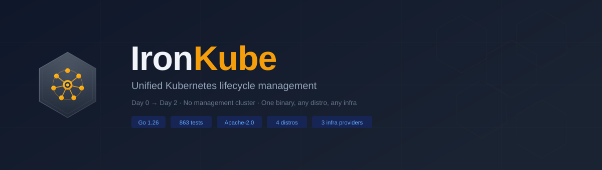
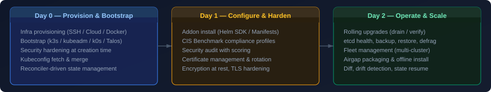
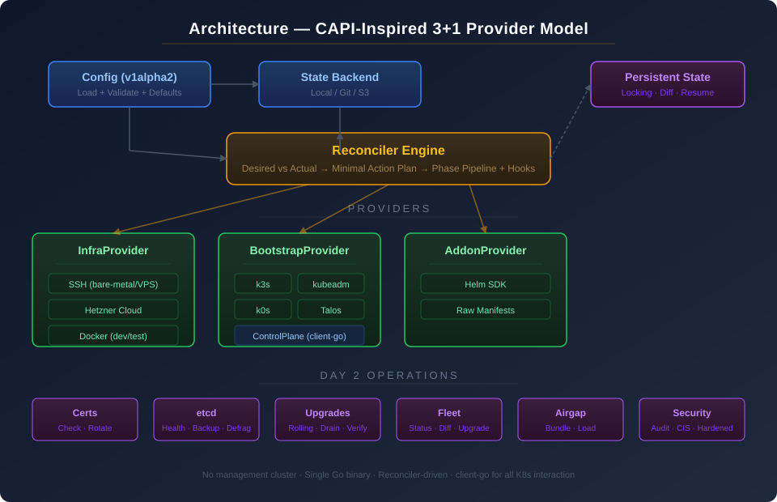

<p align="center">
  
</p>

<p align="center">
  <a href="https://github.com/rohitg00/ironkube/actions"></a>
  <a href="LICENSE"></a>
  <a href="https://pkg.go.dev/github.com/rohitg00/ironkube"></a>
  
  
</p>

<p align="center">
  Unified Kubernetes lifecycle management — Day 0 through Day 2 — with no management cluster.<br>
  One binary, one config, any distro, any infrastructure.
</p>

<p align="center">
  
</p>

## Key design decisions

- **CAPI-inspired provider model** without a management cluster — 3+1 pluggable provider interfaces (Infra, Bootstrap, ControlPlane, Addon)
- **Persistent state** with locking — tracks machines, addons, certs, operations; enables diff, drift detection, and resume
- **client-go for K8s interaction** — no shelling out to kubectl
- **Reconciler-driven** — compares desired config against actual state, generates minimal action plans

## Supported providers

| Type | Providers |
|------|-----------|
| Infrastructure | SSH (bare-metal/VPS), Hetzner Cloud, Docker (dev/test) |
| Bootstrap | k3s, kubeadm, k0s, Talos |
| ControlPlane | Universal (client-go, works with any distro) |
| Addons | Helm SDK, raw manifests |

## Install

```bash
go install github.com/rohitg00/ironkube/cmd/ironkube@latest
```

## Quick start

Create `cluster.yaml`:

```yaml
apiVersion: ironkube.io/v1alpha2
kind: ClusterConfig
metadata:
  name: production
spec:
  distro: k3s
  version: v1.28.2+k3s1
  infrastructure:
    provider: ssh
  controlPlane:
    replicas: 3
    nodes:
      - host: 10.0.0.1
        user: root
        port: 22
      - host: 10.0.0.2
        user: root
        port: 22
      - host: 10.0.0.3
        user: root
        port: 22
  workers:
    - name: compute
      nodes:
        - host: 10.0.0.10
          user: root
        - host: 10.0.0.11
          user: root
  networking:
    podCIDR: 10.244.0.0/16
    serviceCIDR: 10.96.0.0/12
  security:
    profile: cis
  addons:
    - name: cilium
      enabled: true
      chart: cilium
      repository: https://helm.cilium.io
      version: "1.15.0"
      namespace: kube-system
  lifecycle:
    certs:
      autoRotate: true
      rotateBeforeExpiry: 30d
    etcd:
      backupSchedule: "0 2 * * *"
      backupRetention: 7
    upgrades:
      strategy: rolling
      maxUnavailable: 1
```

```bash
ironkube apply -c cluster.yaml --dry-run
ironkube apply -c cluster.yaml
```

## Architecture

<p align="center">
  
</p>

## CLI commands

```text
ironkube apply      -c <config>              Create or update a cluster
ironkube destroy    --name <cluster> --yes   Tear down a cluster
ironkube status     --name <cluster>         Show cluster state
ironkube diff       -c <config>              Show what would change

ironkube certs check   --name <cluster>      Check certificate expiry
ironkube certs rotate  --name <cluster>      Rotate certificates

ironkube etcd health   --name <cluster>      Check etcd health
ironkube etcd backup   --name <cluster>      Create etcd snapshot
ironkube etcd defrag   --name <cluster>      Defragment etcd

ironkube upgrade plan  --name <cluster> --version <target>
ironkube upgrade apply --name <cluster> --version <target>

ironkube backup create  --name <cluster> --output <dir>
ironkube backup restore --name <cluster> --snapshot <path>

ironkube fleet status  -c <fleet.yaml>       Fleet-wide status
ironkube fleet diff    -c <fleet.yaml>       Fleet-wide diff
ironkube fleet upgrade -c <fleet.yaml> --version <target>

ironkube airgap bundle -c <config> --output <dir> --arch amd64
ironkube airgap load   --bundle <dir> --name <cluster>

ironkube security profiles                   List security profiles
ironkube security audit --name <cluster> --profile cis

ironkube config validate -c <config>         Validate config
ironkube config defaults -c <config>         Show config with defaults

ironkube state list                          List clusters in state
ironkube state inspect --name <cluster>      Show raw state
ironkube state delete  --name <cluster>      Delete state
```

## Security profiles

| Profile | Description |
|---------|-------------|
| `minimal` | Default. No additional hardening flags. |
| `cis` | CIS Kubernetes Benchmark: anonymous auth disabled, audit logging, RBAC, protect-kernel-defaults, read-only kubelet port disabled, etcd mutual TLS |
| `hardened` | CIS + admission plugins (NodeRestriction, PodSecurity), encryption at rest, TLS 1.2 minimum, restricted cipher suites |

## Config reference

```yaml
apiVersion: ironkube.io/v1alpha2
kind: ClusterConfig
metadata:
  name: string                      # cluster name (required)
  labels: {}                        # arbitrary labels
spec:
  distro: k3s | kubeadm | k0s | talos   # (required)
  version: string                        # K8s version (required)
  infrastructure:
    provider: ssh | hetzner | docker     # (default: ssh)
    ssh:
      keyPath: ~/.ssh/id_rsa
    hetzner:
      tokenEnv: HCLOUD_TOKEN
      location: fsn1
      serverType: cx21
      image: ubuntu-22.04
      sshKeyName: my-key
    docker:
      image: kindest/node
      network: ironkube
  controlPlane:
    replicas: 1 | 3 | 5                 # must be odd for HA
    nodes:
      - host: string                    # IP or hostname
        user: root                      # SSH user (default: root)
        port: 22                        # SSH port (default: 22)
        keyPath: string                 # per-node SSH key override
  workers:
    - name: string                      # pool name
      nodes: []                         # same as controlPlane nodes
      count: int                        # for cloud providers
      labels: {}
      taints:
        - key: string
          value: string
          effect: NoSchedule | PreferNoSchedule | NoExecute
  networking:
    podCIDR: 10.244.0.0/16
    serviceCIDR: 10.96.0.0/12
  security:
    profile: minimal | cis | hardened   # (default: minimal)
    encryptionAtRest: false
    auditLogging: false
  addons:
    - name: string
      enabled: true
      chart: string                     # Helm chart name
      repository: string               # Helm repo URL
      version: string
      namespace: string
      values: {}                        # Helm values
  lifecycle:
    certs:
      autoRotate: false
      rotateBeforeExpiry: 30d
    etcd:
      backupSchedule: "0 2 * * *"       # cron format
      backupRetention: 7
      compactionInterval: 5m
    upgrades:
      strategy: rolling
      maxUnavailable: 1
  state:
    backend: local | git | s3           # (default: local)
    git:
      repo: string
      branch: main
    s3:
      bucket: string
      region: string
      prefix: string
```

## Fleet config

```yaml
apiVersion: ironkube.io/v1alpha2
kind: FleetConfig
metadata:
  name: my-fleet
spec:
  clusters:
    - path: ./clusters/us-east.yaml
      labels:
        region: us-east-1
        env: production
    - path: ./clusters/eu-west.yaml
      labels:
        region: eu-west-1
        env: production
  policies:
    maxConcurrentUpgrades: 1
    upgradeWindow: "02:00-06:00"
```

## Development

```bash
make build       # Build binary
make test        # Run all tests (863 tests)
make lint        # go vet
make coverage    # Generate coverage report
```

## Examples

- [Single-node k3s](examples/single-node-k3s.yaml)
- [HA kubeadm with CIS hardening](examples/ha-kubeadm.yaml)

## License

Apache-2.0
